# Advanced Git

* [A Review Of Git Basics](#a-review-of-git-basics)
* [Visit Older Points Of History On The Git Timeline](#visit-older-points-of-history-on-the-git-timeline)
* [Experimentation With Branches](#experimentation-with-branches)
* [Throwing Away Bad Work: A Word Of Warning](#throwing-away-bad-work-a-word-of-warning)
* [Get Rid Of *Uncommitted* Changes With `git checkout` Or `git restore`](#get-rid-of-uncommitted-changes-with-git-checkout-or-git-restore)
* [Get Rid Of *Committed But Un-Pushed* Changes With `git reset --hard`](#get-rid-of-committed-but-un-pushed-changes-with-git-reset-hard)
* [Get Rid Of *Committed* And *Pushed* Changes With `git revert`](#get-rid-of-committed-and-pushed-changes-with-git-revert)
* [Resolving Merge Conflicts](#resolving-merge-conflicts)
* [Which Idiot Is To Blame For This Awful Code?](#which-idiot-is-to-blame-for-this-awful-code)
* [Using `git bisect` To Track Down A Bug](#using-git-bisect-to-track-down-a-bug)


## A Review Of Git Basics

```bash
$ git help glossary
$ git help ...
$ git clone git@gitlab.cs.usu.edu:duckiecorp/cs1440-falor-erik-assn3.git
$ git remote rename origin old-origin
$ git remote add origin git@gitlab.cs.usu.edu:USERNAME/cs1440-LAST-FIRST-assn3.git
$ git diff
$ git add FILENAME ...
$ git commit -m "Commit Message"
$ git tag designed
$ git log
$ git push origin master designed
```


### How To Refer To Objects In Git

A Git **object** may be referred to by any of these names:

0.  An SHA-1 commit name, a.k.a. the "true name" (e.g.  `6b0fdef75fc709f95aedda60b9693093e086710e` or an abbreviation `6b0fdef7`)
1.  `HEAD`, referring to the currently checked-out commit.  This is the Git equivalent to the current working directory `.` in the terminal.
2.  A name of a branch (e.g. `master`, `origin/master`)
3.  The name of a tag (e.g. `tag_v1`, `deployed`)
4.  A revision that is `N` generations older than a named commit.  Combine the name of the base commit with a generation number using a tilde `~`.  For example:
    *    `HEAD~1` is the previous commit
    *    `master~3` is the great-grandparent commit of the tip of the branch `master`
    *    `deployed~2` is the 2nd-to-last commit before you finished the *deployment* phase of an assignment

This list is not exhaustive.  Read `git help revisions` to learn all of the ways you can refer to commit objects in the log.

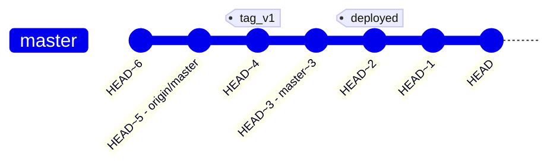


## Visit Older Points Of History On The Git Timeline

*Protip:* For best results, commit or discard unsaved changes before attempting to time-travel.  Otherwise, be prepared to discard your changes.

The `git checkout` command is used to move `HEAD` to another commit in the history.  This command causes Git to make the working tree become identical to the state recorded in `OBJECT`.  This is how you travel back in time with Git.

#### Checkout

*   The action of updating all or some of your source code files to match what is recorded in the repository
    *   Think of a library of books
    *   You "check out" one batch of books at a time
    *   When you want to read different books, you return the old and check out new ones
*   Performed with the `git checkout` and `git switch --detach` commands.


As with the other Git commands discussed in this article, an `OBJECT` can be referred to by any of the following names:

0.  An SHA-1 object name, which may be abbreviated to the first 7 or 8 characters
1.  A relative reference such as `HEAD` or `-`
2.  The name of a tag
3.  A branch name such as `master`, `main`, `devel`, etc.

**Examples**

### `git checkout -`
*   Return to the previous location of `HEAD`

### `git checkout master`
*   Return to the latest commit on the `master` branch

### `git checkout ebb9299`
*   Set `HEAD` at commit `ebb9299`, detaching from the current branch

### `git checkout master~3`
*   Set `HEAD` at the 3rd ancestor commit behind the tip of the `master` branch, detaching from the current branch

When you checkout a commit in the past you may see a notice that you are in 'detached HEAD' state.  `git status` may also report this to you.  *Detached HEAD* simply means that you are not currently on a branch.  These diagrams illustrate the situation:

#### Before detaching `HEAD`:

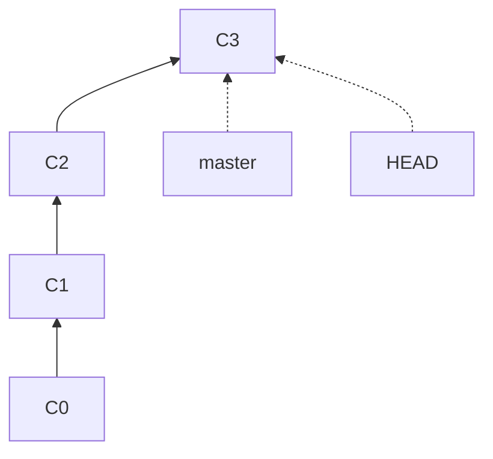

#### After running `git checkout C1`:

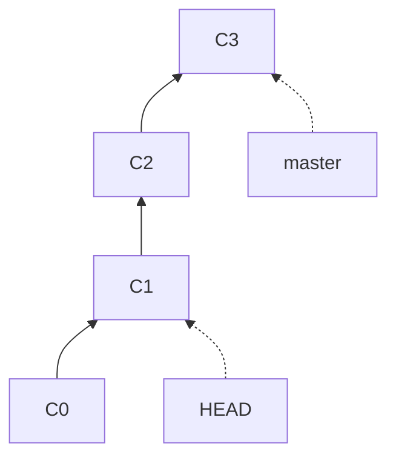

Remember, `HEAD` is the name of the currently checked-out commit.  Usually this is located at the "tip" of the branch named `master`.  You'll learn about branches later on, but for now you can just follow the on-screen instructions to re-attach your `HEAD` (if so desired).


## Experimentation With Branches

One of Git's biggest selling-points over other version control systems is its branching system.  Branches in Git are easy to *make*, easy to *delete*, and easy to *merge*.  They are an excellent way for you to confidently experiment with your code.

With branches your workflow may go like this:

0.  Dive in and start making a risky change
1.  At any time before you commit, you can decide to create a new branch
2.  Now your commits cause the new branch to grow, instead of the master branch
3.  If your experiment fails, you can easily return to the master branch
4.  If your experiment succeeds, you can merge the new branch into master

The images in this tutorial by Atlassian may help you visualize what's going on with branches:

https://www.atlassian.com/git/tutorials/using-branches


### `git checkout -b BRANCHNAME`
### `git switch -c BRANCHNAME`
Create a new branch named `BRANCHNAME`, and make it the current branch.  `HEAD` still points to the same commit that you were on before, but *new* commits will now be added to this branch.  New commits will not become a part of the old branch you were on.

*Note: the `git switch` command was added in version 2.23 (August 2019).  It is more-or-less equivalent to `git checkout` and you may use either command*


### `git checkout BRANCHNAME`
### `git switch BRANCHNAME`
Make the branch `BRANCHNAME` become the current branch.

This involves editing the currently checked-out files (the working tree) to match their configuration in the target branch.  If doing so would cause your uncommitted changes to be lost, Git will stop and ask you to take action (either to commit, stash, or discard your changes).


### `git branch`
List the branches you have checked out in this repo.


### `git branch -a`
List all of the branches in your repo, including branches from the remote repositories you have fetched from.


### `git show-branch`
List all of the branches you have checked out in this repo, and show which commits belong to each one. Branches contain the same commit when the `*` or `+` symbols are present in each of their columns.


### `git show-branch --more=10`
Git's show-branch command stops displaying history as soon as it reaches the earliest common ancestor for all commits. The --more argument tells it to go back further, if possible.


### `git log --graph`
Draw an ASCII-art family tree of commits, nicely illustrating how merges have worked out through history.

Ordinarily, Git commits have exactly *one* parent.  Merges result from one commit having two or more parents.


### `git branch -d BRANCHNAME`
Safely delete the branch `BRANCHNAME`.

Git will not allow you to delete a branch whose commits are not also present in another branch.  Use `git branch -d` after you have successfully merged one of your experimental branches into a permanent branch such as `master`.


### `git branch -D BRANCHNAME`
Dangerously delete the branch `BRANCHNAME`.

Use  `git branch -D` when you have determined that your experiment has gone terribly wrong, and you're positive that you will never need to even look at this code ever again.

It should be noted that the commits don't actually go anywhere; the name of the branch is the only thing which is truly deleted. But without a name it is difficult for you to recover those lost commits. This is why deleting branches should only be done with care.


### `git push REMOTE BRANCHNAME`
Send commits in `BRANCHNAME` to `REMOTE`.

So far you've only been pushing your master branch to GitLab.  You can push other branches, too.  The GitLab website defaults to showing the master branch, but you can view commits in other branches as well.

Because we see the master branch by default, this is the branch that will be graded.  Make sure that your master branch contains *all* commits that make up your final submission.


### `git merge BRANCHNAME`
Make the commits in `BRANCHNAME` become part of the currently checked-out branch.

If you are following best-practices and keeping all risky work off the master branch, there will come a time when you decide that your experiment is a success that deserves to be publicized.  The `merge` command is how to conclude a successful experiment.

Generally, you will first run `git checkout master` or a similar command before merging your work into permanent branch.

```bash
$ git checkout experiment
$ vim main.py
...
$ git add main.py
$ git commit -m Eureka\!\!\!
$ git checkout master
$ git merge experiment
```


#### Example: Fix a bug in `master` while on a side-quest

The following diagrams illustrate how two branches are used in parallel to safely develop an experimental new feature.

Start on the `master` branch where the latest commit has the message "working master":


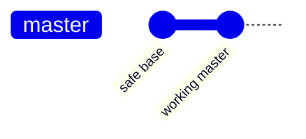

Now a new branch named `experiment` is created with the command `git checkout -b experiment`.  At this point the names `master` and `experiment` both point to the same commit.

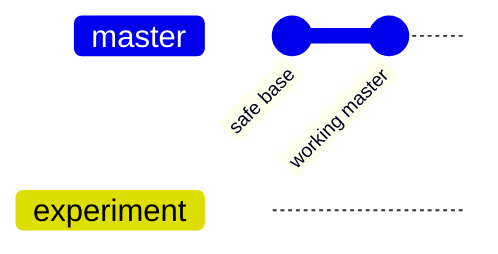

An experimental feature is started on the new branch.  The application does not quite work flawlessly in this branch, but that's okay; *you have to break eggs to make an omelette*.  Because the new commits are isolated from `master`, the developer can always switch back to a good, working version by running `git checkout master`.

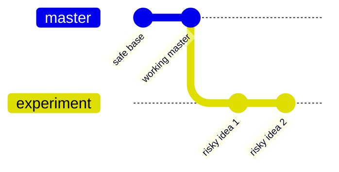

While the experimental work was underway a bug was reported by a customer in the `master` version of the app.  Git enables the developer to pause their work on the experimental feature, switch back to `master`, and fix the bug.  A new version of the app can be published from `master`.

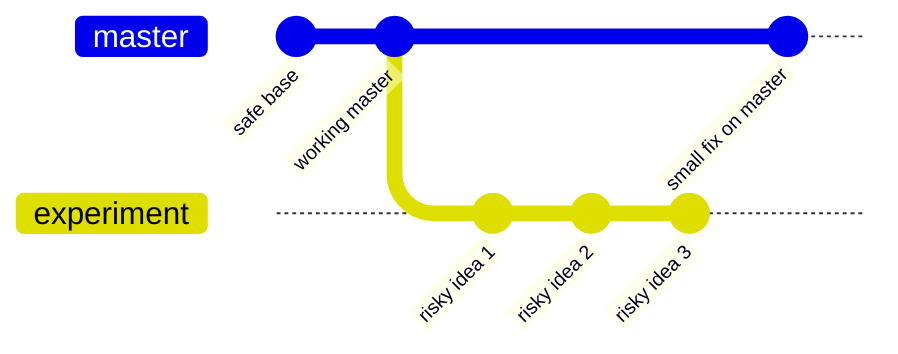

Afterward, development on the new feature can be resumed by running `git checkout expirement`  In this dia.

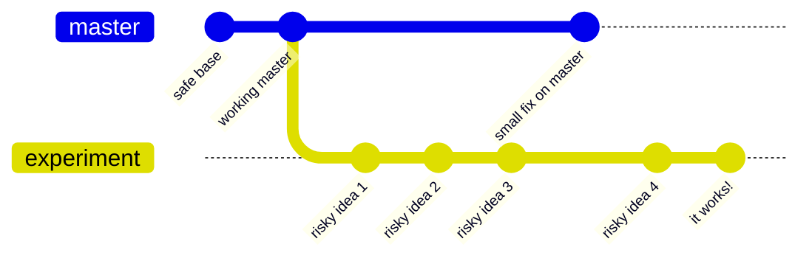

From this point there are two possibilities:

0.  The experiment is a failure.  Perhaps the new feature is not useful after all, or the developer was unable to get it working.
    -   In this case the developer runs `git branch -D experiment` to remove the branch name.  The commits still exist, but unless their SHA-1 names were recorded by the developer, they are unreachable.  After a few weeks they will be silently deleted from the repository.
1.  The experiment is successful and your boss wants to ship it to your customers.
    -   In this case the `experiment` branch can be **merged** into `master`, making those commits a permanent part of the project's history.  This is done by:
        -   `git checkout master`
        -   `git merge experiment`

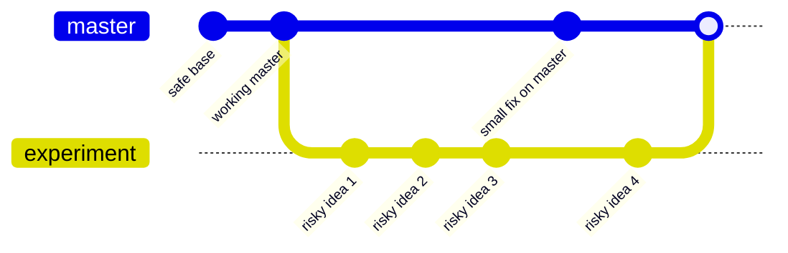

After the experimental commits are merged into `master` the `experiment` branch can be deleted with `git branch -d experiment`; because the commits are now part of the `master` branch they are not at risk of deletion.


## Throwing Away Bad Work: A Word Of Warning

In the next section I will teach you how to use some commands which, used unwisely, can result in a broken repository.  As Git has a mind like a steel trap it's actually quite hard to make Git forget things entirely.  The trick lies in cajoling Git into remembering.

### `git reflog`
You ought to pay close attention any time Git shows a message containing a SHA-1 sum; Git will do that whenever it thinks you're about to do something risky.

But sometimes mistakes happen.  This powerful command displays the log of repository-modifying actions that Git has undertaken *in your local repository*.

This information *may* be used to track down commits which have been pruned off of the tree.  But there are caveats.

0.  The reflog only records information about `checkout` and `switch` commands taken *in your local repo* on your own computer.
1.  The reflog isn't backed up anywhere.  Notably, running `git push` does **not** sync it to the remote server.
2.  Reflog entries have an expiration date.  Exactly when they will expire is hard to say; it could be weeks or months into the future.
    *   You can manually clean the reflog by running `git gc` (garbage collect) or `git reflog expire`.
    *   In any event, there can not be any reflog entries for events before the repo was cloned.


## Get Rid Of *Uncommitted* Changes With `git checkout` Or `git restore`

Sometimes you find out pretty quickly that you're barking up the wrong tree.  Or, perhaps you have accidentally deleted an important file.  Whoops!  With Git, this is not a big deal.


### `git restore FILENAME`
### `git checkout -- FILENAME`
*   Discard changes in working directory.  This command lets you undo uncommitted changes on a file-by-file basis.

### `git restore .`
### `git checkout -f`
*   The nuclear option.  Discard *all* changes in the working directory, permanently undoing any changes which have not been committed.
*   The only way I know of to reverse the effect of this command is this unreliable procedure:
    1.  *If* your editor was running and had the affected file(s) open
    2.  *And* your editor doesn't _automagically_ re-read files from the disk when Git updates them
    3.  *Then* re-save the file from the editor's memory back to disk


### `git restore :/`
*   If the last command was the nuclear option, this is the *Tsar Bomba*
*   Undo all uncommitted changes *anywhere in the entire repository*


## Get Rid Of *Committed But Un-Pushed* Changes With `git reset --hard`

Other times you realize that you have not only made a mistake, but have committed to it by permanently recording it in your repository.  Well, perhaps "permanent" is too strong a word... if you haven't yet pushed your latest changes to a remote repository you can erase these commits and make this appear like nothing happened at all.  As they say, what happens in Vegas, stays in Vegas.


### `git reset --hard REVISION`
*   Move `HEAD` and the current branch to the commit specified by `REVISION`.
*   To undo the most recent commit, run `git reset --hard HEAD~1`
    *   *Tip:* `HEAD~1` refers to the *parent* of `HEAD`.
*   You can advance both `HEAD` and the current branch forward in time, too; you'll just need a way to refer to that commit, perhaps by looking up it's SHA-1 hash name in  `git reflog` or `git log`.


#### Before running `git reset --hard HEAD~1`

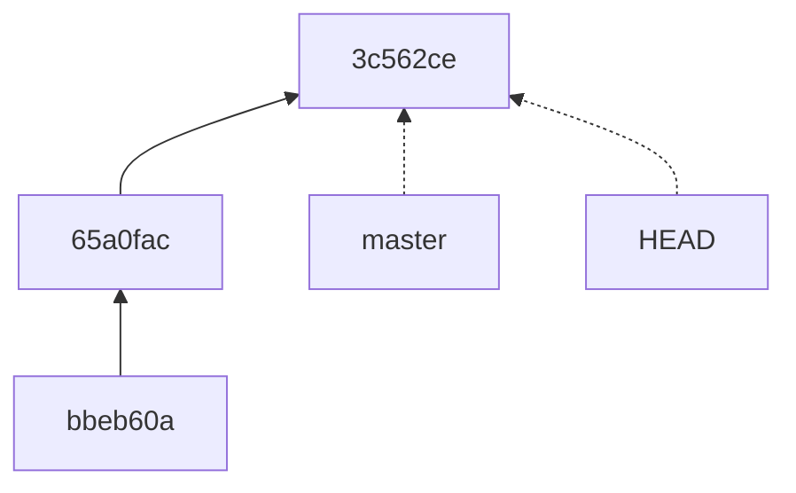


#### After running `git reset --hard HEAD~1`

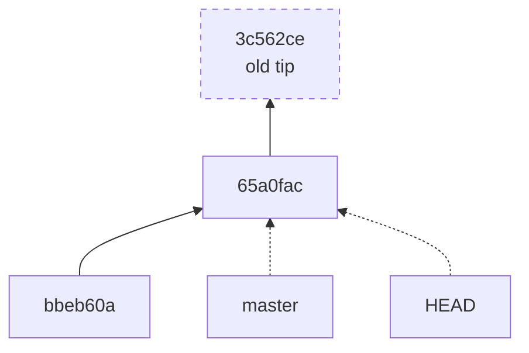

## Get Rid Of *Committed* And *Pushed* Changes With `git revert`

The problem of playing with the timeline is that you may create a paradox or inadvertently write yourself out of history.  The latter is possible through using commands such as `git reset --hard` which have the power to change commits in the past.  The negative effects will be noticed when you next try to push your changes to a remote repository, which will notice that you are missing a few things and refuse to accept your changes until your version of history agrees with its own.

You can avoid this situation by *adding* instead of removing commits.  Create and record a new commit which is the *inverse* of the commit which you wish to remove.  This is called *reverting* a commit.  Instead of your mistake never appearing in the log, the timeline will record the mistake and another commit which negates it.  I don't have a tourism slogan to describe this circumstance, I guess you'll just have to swallow your pride and own up to the fact that you goofed up.

### `git revert -n REVISION`
*   Create and add to the staging area a commit which is the *inverse* of `REVISION`.
    *   Lines which were added `+` by this commit become deletions `-`, and vice versa.
*   By default `git revert` also does a `git commit` automatically, which puts you into a text editor to get your commit message about the revert.
    *   if Git thinks that you like to use Vim, you may have a bad time.
    *   The `-n` switch avoids automatically committing the change, and thus avoids dumping you into Vim


#### `git revert` Adds a New Commit

In this diagram, the change introduced by commit `C2` contains a bug. Unfortunately, the bug was not noticed before `C2` was pushed to `origin`.  Because that commit has been publicized to other developers, running `git reset` would create a paradox that will create problems the next time they run `git pull`.

Instead of erasing their mistake, the author of `C2` needs to issue a public retraction with `git revert -n C2`.

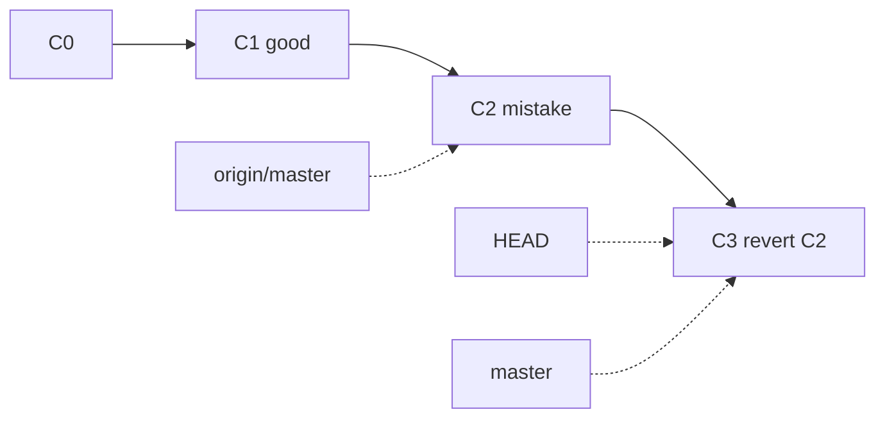

This creates a new commit that can now be safely pushed to `origin`.  The commit `C3` is the inverse of `C2`: all additions (`+`) in `C2` are now deletions (`-`), and vice-versa.


## Resolving Merge Conflicts

When merging two branches into one there is a risk that a conflict will occur.
When you use the merge command you are asking Git to combine multiple versions
of a file into one.

#### Merge Conflict

A *merge conflict* occurs when two or more commits merged from different branches change the same portion of the same file.  Git cannot automatically proceed merge without losing data and halts the merge.  You must then review the conflicting changes and manually bring about a resolution.

Git will annotate the affected files with *merge markers*.  These boundaries surround the code that it appears in your branch and in the branch that is being merged in.

Clone my [merge-conflict](https://gitlab.cs.usu.edu/duckiecorp/merge-conflict) repo from GitLab and follow along with me.

*In these code examples a dollar sign `$` represents your shell's prompt.  It is shown to distinguish commands that you type from the output they produce. Do not type the `$` when you run these commands yourself.*


```bash
$ git clone https://gitlab.cs.usu.edu/duckiecorp/merge-conflict.git

$ cd merge-conflict

$ git branch
* master

$ git branch -a
* master
  remotes/origin/HEAD -> origin/master
  remotes/origin/fac
  remotes/origin/fib
  remotes/origin/master
```


At this point the repo looks like this:

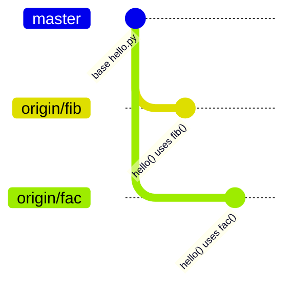

The change in the `fib` branch has no conflicts with `master` and can be cleanly merged.

```bash
$ git merge origin/fib
Updating ffa9653..5b1b969
Fast-forward
 hello.py | 9 ++++++++-
 1 file changed, 8 insertions(+), 1 deletion(-)
```


Now the repo looks like this:

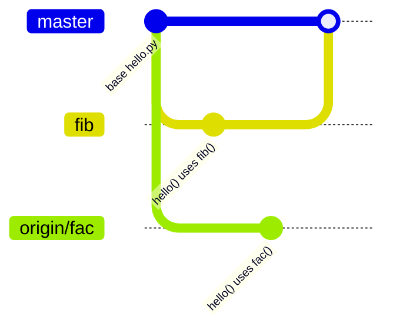

Git runs into trouble upon merging `fac` into `master`.  This is because the changes introduced by the `fib` and `fac` branches are incompatible with each other:

```bash
$ git merge origin/fac
Auto-merging hello.py
CONFLICT (content): Merge conflict in hello.py
Automatic merge failed; fix conflicts and then commit the result.
```


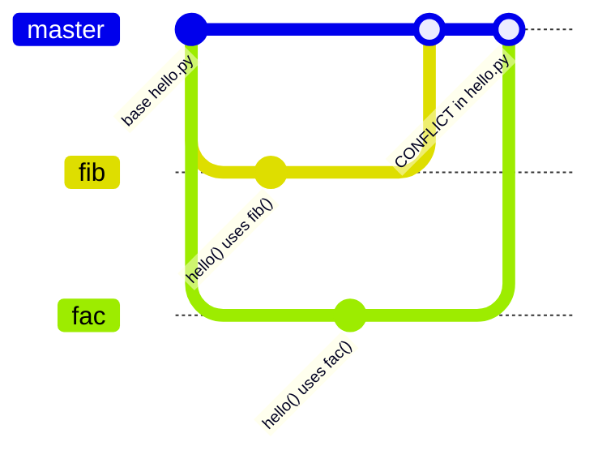


At this point you, the human, must step in and fix `hello.py`.  You will do this by locating the conflicting *hunks* in the file and rewriting them so that the source code makes sense again.

Git makes it easy to find the conflicts.  It indicates them with *conflict markers* `<<<<<<<`, `=======`, and `>>>>>>>`.  They look like this:

```python
<<<<<<< HEAD
def fib(n):
    if n < 2:
        return 1
    else:
        return fib(n-1) + fib(n-2)


def hello(who, n):
    for i in range(fib(n)):
=======
def fac(n):
    if n < 2:
        return 1
    else:
        return n * fac(n-1)


def hello(who, n):
    for i in range(fac(n)):
>>>>>>> fac
        print(f"{i:3}: Hello {who}")


# Is it lunch time yet?
hello('Fries!!', 4)
hello('Hamburgers!!', 5)
```

Conflict markers manifest as syntax errors in *most programming languages*, you can't easily miss them.

The first hunk between `<<<<<<<` and `=======` denotes the code in the currently-checked out commit (that's what `HEAD` means, after all).

Code between the `=======` and `>>>>>>>` markers came from a branch named `fac`.

Do you see the conflict?  There are two versions of `hello()`: one that calls `fib()` and one that calls `fac()`. The conflict arises because both branches edited the same line in different ways.  Git isn't smart enough to know whether one version should remain or if both should be kept.  This is why Git has halted the merge; it takes human judgement to decide how to untie this knot.


### I Don't Do Conflict, I Give Up!

If you can't (or don't want to) deal with the conflicting code right now, you can undo the merge with `git merge --abort`:

```bash
$ git status
On branch master
You have unmerged paths.
  (fix conflicts and run "git commit")
  (use "git merge --abort" to abort the merge)

Unmerged paths:
  (use "git add <file>..." to mark resolution)
    both modified:   hello.py

no changes added to commit (use "git add" and/or "git commit -a")

$ git merge --abort

$ git status
On branch master
nothing to commit, working tree clean
```

This takes you back to the version of `hello.py` that uses the Fibonacci function:


#### Fixing The Conflict

One way to resolve the conflict is to define two functions in the source code:

```python
def helloFib(who, n):
    for i in range(fib(n)):
        print(f"Hello {who}")

def helloFactorial(who, n):
    for i in range(fac(n)):
        print(f"Hello {who}")
```

Then, visit every site in the program where `hello()` is used and change those calls to use one of the above functions.

Alternatively, you could keep one version of `hello()` but give it an extra parameter so either `fib()` or `fac()` can be passed in:

```python
def hello(who, fn, n):
    for i in range(fn(n)):
        print(f"Hello {who}")


# Is it lunch time yet?
hello('Fries!!', fib, 4)
hello('Hamburgers!!', fac, 5)
```

In this version every call site of `hello()` still needs to be changed.  Whatever choice you make, it will be much more sophisticated than what Git could do on its own.

Once you have fixed the code and removed the conflict markers, run `git add hello.py` followed by `git commit` to conclude the merge.


## Which Idiot Is To Blame For This Awful Code?

This is question that will cross your mind from time to time.  Fortunately, `git blame` can help you find out exactly which commit (and developer) last touched each line of code.

### `git blame -- FILENAME`

Annotate every line of `FILENAME` with the commit hash, author, and date it its last modification.  It's a great way to trace changes, understand history, and figure out when (and sometimes why) something went wrong (hopefully, it wasn't you).  Before you make your next commit, remember that your psychopathic co-worker knows this command, too.

You can use this command to discover which commit introduced a bug or behavior change.  It reveals the history of a function's evolution, which is helpful when refactoring or optimizing.  To get more information about the context of a change pass its SHA-1 commit ID to `git show <commit>` to see the full commit message.

Use this power for good: just as easily as you can shame a programmer for shoddy work, you can credit the right person when you find beautiful code that works flawlessly.


## Using `git bisect` To Track Down A Bug

Git's commit history is invaluable for understanding project evolution, but a long history with numerous commits can become overwhelming.  Git's `bisect` command helps manage this by performing a search through the commit history to pinpoint exactly when a key change was introduced.

In previous semesters I showed a demo with the Vim source code where I used `git bisect` to determine when a subtle bug was introduced.  This was a tricky problem in the Vim community some years ago because the bug went unnoticed for two and a half months.  Over 400 commits were made in that time.  Going through that many commits, one-by-one, to pin down when the bug was introduced is possible, but tedious.  `git bisect` made that job very easy.

Unfortunately, I can no longer show you that demo because a new problem has come up.  A change, either in Vim itself, an underlying code library, or my C compiler makes older versions of Vim un-buildable on my computer.  So my question now is "when did *that* happen"?  You can use `git bisect` to find out!


### Checking if Vim Builds

Obtain Vim's source code with this command:

```bash
$ git clone https://github.com/vim/vim.git
$ cd vim
```

Assuming that you have a working C compiler and the needed libraries on your system, you can check if a version of Vim builds with the `./configure` command:

```bash
$ ./configure

... lots of output ...

configure: updating cache auto/config.cache
configure: creating auto/config.status
config.status: creating auto/config.mk
config.status: creating auto/config.h
```

This is what a successful build looks like.  When you see this output, the current commit is good; otherwise you are on a bad commit.  The Vim bug that I used in my original demo happened sometime after version 8.0.0691.  Let's go back to that commit and see if Vim is buildable:

```bash
$ git checkout v8.0.0691
$ ./configure

... lots of output ...

curses library is not usable
no terminal library found
checking for tgetent()... configure: error: NOT FOUND!
      You need to install a terminal library; for example ncurses.
      Or specify the name of the library with --with-tlib.
```

This is what a bad commit looks like.

There are *thousands* of commits between `master` and `v8.0.0691`.  You could go back through them one-by-one to pinpoint when Vim broke.  That sounds a lot like a *linear search*, which is a repetitive, tedious, and error-prone process.

<details>
<summary>You learned a better way in CS 1400</summary>

Binary search!

</details>


### Finding a bug with `git bisect`

You need three things to use `git bisect`:

0.  A commit in which the code *worked*
    *   The tip of the `master` branch
1.  A commit which exhibits the *bug*
    *   The commit tagged `v8.0.0691`
2.  A *test* that detects the bug
    *   The output of the `./configure` script
    *   *Pro Tip* In your own projects, use your Unit Tests


To begin a bisect, checkout one of the boundary commits and run this command:

```bash
$ git bisect start
status: waiting for both good and bad commits
```


Tell Git whether this commit is a good one or a bad one.  Because you just had a build error, you are on one of the **bad** commits (e.g. this command is run after checking out the tag `v8.0.0691`):

```bash
$ git bisect bad
status: waiting for good commit(s), bad commit known
```

From here, you want to search forwards in time to learn when this build error stops happening.  It is known that the tip of the master branch works, so you can set the **good** boundary there.

```bash
$ git bisect good master
Some good revs are not ancestors of the bad rev.
git bisect cannot work properly in this case.
Maybe you mistook good and bad revs?
```

Oh no, an error right off the bat!  The part of the message about ancestors sounds weird until you understand a key assumption of `git bisect`.  That assumption is that there exist good commits *before* the bug was introduced, and the bad commits come after.  You are seeking the commit where the bug is introduced:

```
+-- Beginning of the repo                                              tip of the master branch --+
v                                                                                                 V
ggggggggggggggggggggggggggggggggggggggggggggggggggggggggggggggggggBBBBBBBBBBBBBBBBBBBBBBBBBBBBBBBBB
                                                                  ^
                                                                  +-- The bug was introduced here
```

99% of the time when you use `git bisect` this assumption is useful.


However, our situation is of the other 1%:

```
+-- Beginning of the repo                                              tip of the master branch --+
v                                                                                                 V
BBBBBBBBBBBBBBBBBBBBBBBBBBBBBBBBBBBBBBBBBBBBBBBBBBBBBBBBBBBBBBBBBBggggggggggggggggggggggggggggggggg
                                                                  ^
                                                                  +-- The bug was fixed here
```

In other words, `git bisect` expects **good** commits to come *before* the **bad** ones, such that they are the ancestors.  You are asking Git Bisect to work *backwards*.

It's a problem with an easy fix. Just start the bisect over and use different terms besides **good** and **bad**.  Git Bisect also recognizes **old** and **new**.

```bash
$ git bisect reset
HEAD is now at a83fe75ca patch 8.0.0691: compiler warning without the linebreak feature

$ git bisect start
status: waiting for both good and bad commits

$ git bisect old
status: waiting for bad commit, 1 good commit known
```

Notice that it thinks you're on a good commit.  This is not true, but the illusion keeps Git happy.

```
$ git bisect new master
Bisecting: 6915 revisions left to test after this (roughly 13 steps)
[fe3418abe0dac65e42e85b5a91c5d0c975bc65bb] patch 8.2.3136: no test for E187 and "No swap file"
```

**6,915 revisions to test!** Holy cow, that's a lot of commits!  It's a good thing that you're doing a binary search instead of a linear search!  (Note: the number of commits changes across semesters.  The Vim project is active, so the number of commits will grow).

Git has taken you to the commit right in between the **old** and **new** boundaries.  From here, you can do whatever it takes to detect the bug.  For this problem, it means running the `./configure` script.

```
$ ./configure

... lots of output ...

curses library is not usable
no terminal library found
checking for tgetent()... configure: error: NOT FOUND!
      You need to install a terminal library; for example ncurses.
      On Linux that would be the libncurses-dev package.
      Or specify the name of the library with --with-tlib.
```

This is an old (bad) commit, so I'll tell Git so:

```bash
$ git bisect old
Bisecting: 3459 revisions left to test after this (roughly 12 steps)
[af93691b53f38784efce0b93fe7644c44a7e382e] patch 9.0.1330: handling new value of an option has a long "else if" chain
```

You went from 6,915 revisions (commits) down to 3,459.  Now you're getting somewhere!  According to Git's calculations, you'll zero in on the bad commit in about 12 steps.  Onward!

This time, I'll throw in the `make distclean` command to clean up after the `./configure` script.  This prevents side-effects of the previous run of the configuration script from throwing off later tests.

```bash
$ make distclean

... lots of output ...

$ ./configure

... lots of output ...

curses library is not usable
no terminal library found
checking for tgetent()... configure: error: NOT FOUND!
      You need to install a terminal library; for example ncurses.
      On Linux that would be the libncurses-dev package.
      Or specify the name of the library with --with-tlib.

$ git bisect old
Bisecting: 1728 revisions left to test after this (roughly 11 steps)
[23d5770ef5e2f5c6d20d123303b81327045e5a1e] patch 8.2.4824: expression is evaluated multiple times
```

Rinse and repeat.

But still, doing this *11* more times is tedious.  Sure, this is far better than manually testing 6,915 commits, but we're programmers.  We have it within ourselves to be even *more lazy*.


### Automation to the rescue!

You can automate this process by writing a script that distinguishes between good and bad commits.  Instead of asking a human to decide, Git Bisect can use the script and mark each commit as 'old' or 'new' on its own.  As you sit back and watch, it will automatically proceed to the end.


```bash
#!/bin/sh

# Test script for `git bisect run`.  This script is used by git-bisect(1) to
# detect the presence of bug which causes Vim's auto-indent feature to fail.

# 0. Start from a clean state
make distclean

# 1. Run the ./configure script, and save the exit code in a variable
./configure
RESULT=$?

# Every shell command returns an "exit code", which is an integer
# between 0 and 255.  0 means success, and non-zero means failure.
# The shell saves this code in the special variable named $?.
#
# git bisect uses this script's exit code to determine what to do next:
#
# | EXIT CODE      | MEANING
# |----------------|------------------------------
# | 0              | This is a good commit
# | 1-124, 126-127 | This is a bad commit
# | 125            | Skip this commit (i.e. this code cannot be tested)
# | 128-255        | Abort git-bisect(1)


# 2. Because we are running this bisection backwards (to find where the bug
#    STOPS happening as opposed to when it STARTS), we invert the exit code.
#
#    In ordinary circumstances, you can end the script with `exit $RESULT`.
if [[ $RESULT == 0 ]]; then
    exit 1
else
    exit 0
fi
```

Save this in a file in the Vim repository called `bisect-helper.sh`, which can be run with the `sh` shell interpreter.  Now you can automate the entire bisecting process with one command:


```bash
$ git bisect run sh bisect-helper.sh
```

**Note: this is a great time to get a snack**

Once Git has converged on the broken commit you can explore the changes it introduced to find the error behind the failure.  Hopefully, that commit is small and simple so the problem is easy to spot.

After you're all done, this command tells Git to restore the repo to how it was when you began:

```bash
$ git bisect reset
```


### Why this is awesome

Obviously, it's awesome because you were able to cover thousands of commits in about a dozen steps.  `git bisect` is an example of the "Wolf Fence" debugging technique.

This technique works best when your repo contains many *small, focused* commits.  Think about how different it would be if there were 1/10th as many commits, but each one was 10x larger.  Thanks to this tool, the hard part isn't locating the bad commit.  In terms of a binary search, it takes 13 steps to cover 6,915 commits versus 10 steps for 692 commits.

Once when you arrive on that bad commit, the hard part has just begun.

If the commit that introduced the bug is small and focused on a single feature, it won't take too much work to figure out what went wrong.  You might have 20 lines of code to consider.  But if that commit is 10x bigger, you get to sift through 200 changes.


### TL;DR

It is my advice that you make *many small commits* instead of a *few big ones*.

Making small, focused commits enhances your ability to debug an issue across time.  They allow you to quickly and efficiently locate issues using `git bisect`.

While I do not expect you to use this trick anytime soon, I would like you to remember its potential.  Bisect is a powerful tool that many Git users do not know.  Students have informed me, years after hearing this lecture, that knowing about Git Bisect has saved the day for their companies.  So bookmark this page for future reference!


*Updated Tue Mar 17 2026*
