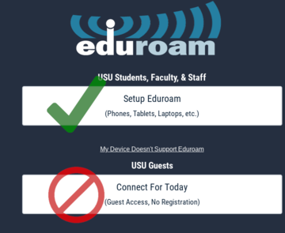

# Your GitLab Account

*   Unless otherwise instructed, all assignments are submitted to the [course GitLab server](https://gitlab.cs.usu.edu).
    *   This means that there is nothing for you to do on Canvas with respect to submitting code.
    *   Post assignment reflections and code review videos *are* submitted to Canvas.
    *   Your grader's comments and your score *are* be found on Canvas.
*   Create an account on my GitLab server and _not_ the public GitLab service at https://gitlab.com.
    *   Look for Old Main  instead of the GitLab logo  in the site's navigation bar.
    *   Your account will be automatically created using your USU identity.
    *   While on campus you must connect using the **Eduroam** network
    *   You *cannot* connect to my GitLab server on the **USU Guest** network
    *   
*   Other online Git services (i.e. GitHub, Bitbucket, Sourcehut) may not be used in this course.
    *   To prevent academic dishonesty, submissions made to public Git repositories cannot be accepted and will receive zero points.
    *   Please talk to me if you would like to include your course work as part of your online portfolio after the semester has concluded.
*   I only grade code found in your repository's default branch.
    *   If you don't know what this means it doesn't apply to you ;)
    *   You may freely use other branches to experiment as you work on the assignment.
    *   Pushes to non-default branches are not taken into consideration when deciding if your work is on-time or late.

<strong>Rationale</strong>

## Why do I make you use Git?

Git is something that I wish somebody taught me when I was a student.

Whenever I speak to industry professionals one of the very first questions they ask me is "do you teach your students how to use Git?"  The [Git Software Configuration Management system](https://git-scm.com/) is the most popular version control system in the world today.  Learning Git in this class immediately puts you at an advantage over your peers who study in other CS programs:

*   Knowing Git = less time spent training you on-the-job.
*   You can post your portfolio to popular online code-hosting services such as GitHub, GitLab, Bitbucket, etc.
*   Version control will help you stay organized in your other classes.

